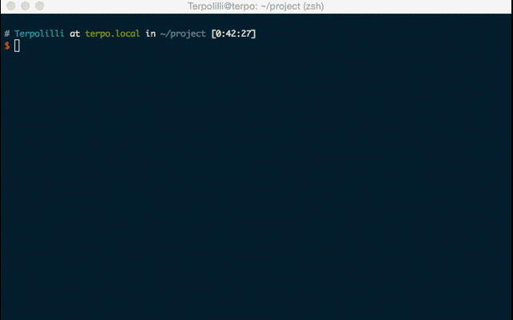

# Hunter

## Hunter 

We believe there will be more and more data available on the web and the main issue will be to find them and to manage each sources. So we try to do it for you: not by pre-processing them but by orienting you. 

## Installation

    $ gem install datahunter

## Usage
### $ hunter find
    $ hunter find population france
    ### Response in 0.569162 seconds
    ### Looks like we've got something for you!

    title: Population

    description: Ce jeu de données permet d'accéder aux résultats des recensements de la population, à des séries chronologiques de la Banque de Données Macro-économiques de l'Insee sur le thème de la population et à d'autres données issues notamment des statistiques de l'état civil. Le recensement de la population permet de connaître la diversité et l'évolution de la population de la France. L'Insee fournit ainsi des statistiques sur les habitants et les logements, leur nombre et leurs caractéristiques : répartition par sexe et âge, professions, diplômes-formation, conditions de logement, modes de transport, déplacements domicile-travail, etc. La BDM est la principale base de données de séries et indices sur l'ensemble des domaines économiques et sociaux.

    publisher: Institut National de la Statistique et des Etudes Economiques (INSEE)

    temporal: ["1962", "1963", "1964", "1965", "1966", "1967", "1968", "1969", "1970", "1971", "1972", "1973", "1974", "1975", "1976", "1977", "1978", "1979", "1980", "1981", "1982", "1983", "1984", "1985", "1986", "1987", "1988", "1989", "1990", "1991", "1992", "1993", "1994", "1995", "1996", "1997", "1998", "1999", "2000", "2001", "2002", "2003", "2004", "2005", "2006", "2007", "2008", "2009", "2010", "2011", "2012", "2013"]

    spatial: ["france", "fr", "europe", "schengen", "eu", "ue", "countries", "world", "all"]

    created: 2014-05-07T02:40:14.478Z

    updated: 2014-11-07T01:32:48.201Z

    score: 25.893

    ### get the data? (y/n)
    => y: open your favorite browser at the page where you'll be able to preview and download the data
    => n: suggest the next most popular dataset corresponding to the query

### $ hunter search

    $ hunter search paris
    ### Response in 0.281749 seconds
    ### We've found 5 datasets corresponding to your query paris:

    Vélib' - Paris et communes limitrophes (https://www.data.gouv.fr/fr/datasets/velib-paris-et-communes-limitrophes-idf/)

    Liste des sites des hotspots Paris WiFi (https://www.data.gouv.fr/fr/datasets/liste-des-sites-des-hotspots-paris-wifi-prs/)

    Liste des casernes à Paris et dans les départements de la petite couronne (https://www.data.gouv.fr/fr/datasets/liste-des-casernes-a-paris-et-dans-les-departements-de-la-petite-couronne-551678/)

    Points d'accueil police (coordonnées) - Paris (https://www.data.gouv.fr/fr/datasets/points-d-accueil-police-coordonnees-paris-30379560/)

    Lieux de tournage de films (long métrage) (https://www.data.gouv.fr/fr/datasets/lieux-de-tournage-de-films-long-metrage-prs/)

## Feedbacks
Don't hesitate to [give us any feedback about you experience with Hunter!](https://docs.google.com/forms/d/1yNzZjCCXvWHQCbWz4sx-nui3LafeeLcT7FF9T-vbKvw/viewform?usp=send_form)

## Roadmap

* more datasets
* download datasets from the terminal
* more generic lib to make the API more easy to reuse

## Contributing

1. Fork it ( https://github.com/nterpo/datahunter/fork )
2. Create your feature branch (`git checkout -b my-new-feature`)
3. Commit your changes (`git commit -am 'Add some feature'`)
4. Push to the branch (`git push origin my-new-feature`)
5. Create a new Pull Request

## License

Copyright (c) 2014 Terpolilli

MIT License

Permission is hereby granted, free of charge, to any person obtaining
a copy of this software and associated documentation files (the
"Software"), to deal in the Software without restriction, including
without limitation the rights to use, copy, modify, merge, publish,
distribute, sublicense, and/or sell copies of the Software, and to
permit persons to whom the Software is furnished to do so, subject to
the following conditions:

The above copyright notice and this permission notice shall be
included in all copies or substantial portions of the Software.

THE SOFTWARE IS PROVIDED "AS IS", WITHOUT WARRANTY OF ANY KIND,
EXPRESS OR IMPLIED, INCLUDING BUT NOT LIMITED TO THE WARRANTIES OF
MERCHANTABILITY, FITNESS FOR A PARTICULAR PURPOSE AND
NONINFRINGEMENT. IN NO EVENT SHALL THE AUTHORS OR COPYRIGHT HOLDERS BE
LIABLE FOR ANY CLAIM, DAMAGES OR OTHER LIABILITY, WHETHER IN AN ACTION
OF CONTRACT, TORT OR OTHERWISE, ARISING FROM, OUT OF OR IN CONNECTION
WITH THE SOFTWARE OR THE USE OR OTHER DEALINGS IN THE SOFTWARE.
